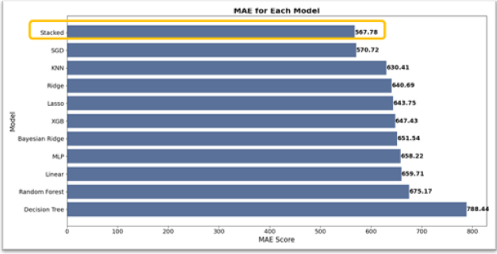
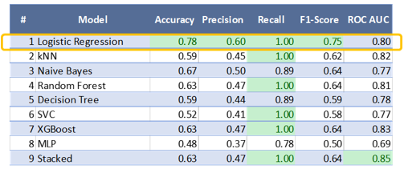
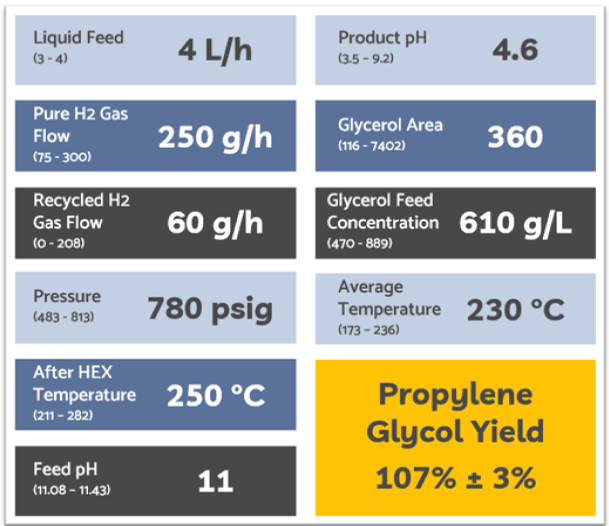

# Glycerin-to-Glycol Production Using Machine Learning

## Overview

This project applies data science and machine learning to improve the chemical conversion of glycerin—a by-product of biodiesel production—into commercially valuable compounds: **ethylene glycol (EG)** and **propylene glycol (PG)**. Using real-world plant data and a combination of regression, classification, and optimization techniques, the goal is to support data-driven decision-making, minimize process failures, and maximize glycol yield under varying operational conditions.

Developed in collaboration with **Langara College’s Post-Degree Diploma in Data Analytics**, this project demonstrates how AI and optimization techniques can be applied in real-time industrial settings.

---

## Project Goals

- **Yield Prediction**: Build regression models to accurately forecast glycol output (EG and PG) based on variables like hydrogen flow rate, reactor pressure, temperature, pH, and glycerol concentration.
  
- **Anomaly Detection**: Identify and classify process deviations and early signs of failure through supervised and unsupervised learning models, enabling preventative intervention before significant issues arise.
  
- **Optimization**: Maximize PG yield through a combination of predictive modeling and **Genetic Algorithm (GA)** optimization, tuning key process variables to achieve the highest theoretical yield.
  
- **Deployment Readiness**: Lay the groundwork for building a real-time support system for plant technicians to input live parameters and receive yield forecasts, process health warnings, and optimization guidance.

---

## Methods and Tools

### Data Preprocessing
- Collected ~135 usable rows from pilot plant operations across 30+ process variables.
- Handled extensive missing values by removing columns with more than 90% nulls.
- Performed type conversions (object to numeric), retained real outliers, and addressed multicollinearity by removing redundant features and simplifying temperature inputs.

### Predictive Modeling
- Developed and fine-tuned 11 regression models, including:
  - Linear models (Ridge, Lasso, Bayesian Ridge)
  - Non-linear models (MLP – Multi-Layer Perceptron)
  - Ensemble methods (Stacked Regression, Random Forest)
- Evaluated using metrics such as RMSE, MAE, MAPE, and R².
  ## Optimizing Yield:

### Anomaly Detection
- Labeled outputs as **normal** or **anomalous** based on an 80% glycol yield threshold.
- Applied:
  - **Unsupervised models**: Gaussian Mixture Model (GMM), Isolation Forest, One-Class SVM, DBSCAN.
  - **Supervised models**: Logistic Regression, XGBoost, SVC, kNN, and a Stacked Ensemble.
- Assessed performance using AUC, precision, recall, and F1-score to identify the most reliable early warning indicators.
   

### Optimization Modeling
- Selected the **Stacked Regression Model** (most accurate for PG yield) as the fitness function.
- Applied a **Genetic Algorithm (GA)** to iteratively evolve the best combination of process inputs that maximize PG output.
- Identified optimal parameter ranges that led to a **predicted PG yield improvement of over 7%**, with a theoretical model output exceeding 100% (actual feasibility to be validated with cost and operational constraints).
  

---

## Key Results

- **Overall Glycol Yield Prediction**:
  - MLP achieved the highest prediction accuracy with a MAPE of approximately **3.83%**.
  - Simpler models (Ridge, Bayesian Ridge) also performed well with low error margins and high interpretability.

- **Propylene Glycol Yield Optimization**:
  - Stacked Regression outperformed all other models in RMSE, MAE, and R².
  - Integration with a Genetic Algorithm yielded a **7%+ improvement** in predicted PG yield.

- **Anomaly Detection**:
  - Logistic Regression achieved **perfect recall (1.00)**, making it highly effective at flagging process failures.
  - GMM offered the most balanced unsupervised detection with no anomalies missed and reasonable precision.

---

## Applications

- **Real-Time Operator Tool**: A future-facing app for plant workers to input live process values and receive yield forecasts or early warnings for anomalies.
  
- **Automation Integration**: Predictive models can be deployed within existing process control systems to enable autonomous real-time adjustments.

- **Operational Insights**: Enables leadership and engineers to experiment with “what-if” scenarios digitally before implementing physical changes on-site, improving safety and efficiency.

---

## Next Steps

- **Data Scaling**: Expand the dataset to 500+ samples to enhance generalizability and reduce overfitting risks in modeling.

- **Cost-Aware Optimization**: Include financial constraints and operational limits within the optimization model to ensure solutions are practical and economically feasible.

- **Web Application Development**: Design a user-friendly frontend interface to make the models accessible to non-technical users such as plant operators and technicians.

- **Equipment Integration**: Explore integration with IoT sensors and plant control systems for live data capture, analysis, and automated optimization.

---

## References

- Suppes, G. J. (2011). *Europe Patent No. EP 2298720A2*  
- Carr, J. (2014). *An Introduction to Genetic Algorithms*. Whitman College

---

## Disclaimer

This project is a demonstration of machine learning applications in industrial chemical production. All sensitive plant data, proprietary process variables, and operational parameters have been excluded or generalized to protect confidentiality.
